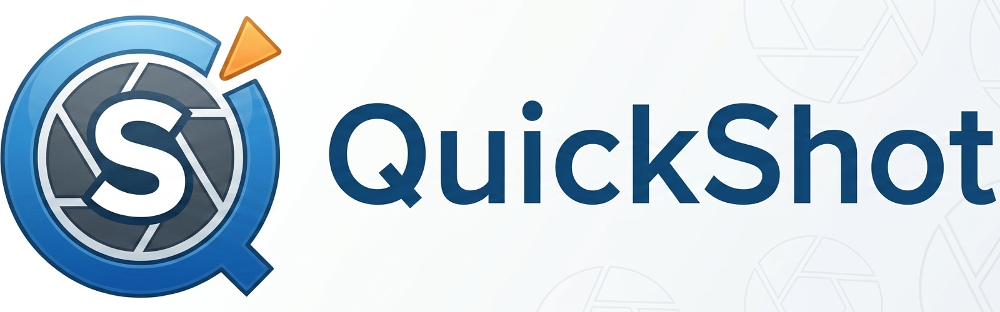

<p align="center">
  
</p>

# <p align="center">QuickShot 📸</p>

<p align="center">
  <strong>Capture. Crop. Copy. Done.</strong><br>
  A lightweight Chrome extension for taking quick, distraction-free screenshots.
</p>


<p align="center">
  
</p>


## Features

* 📸 Select any area of the current webpage
* 🌑 Dimmed overlay for precise selection
* ✨ Live selection preview
* 📋 Copy screenshots directly to your clipboard
* 💾 Download screenshots as PNG
* ❌ Press <kbd>Esc</kbd> anytime to cancel
* ⚡ Lightweight and fast
* 🔒 Works completely locally — no uploads or tracking

---

## Installation

Since QuickShot isn't published on the Chrome Web Store yet, install it manually.

1. Clone this repository

```bash
git clone https://github.com/YOUR_USERNAME/quickshot.git
```

2. Open Chrome and go to:

```
chrome://extensions
```

3. Enable **Developer mode**.

4. Click **Load unpacked**.

5. Select the project folder.

6. Pin the extension from Chrome's toolbar.

You're ready to go.

---

## Usage

1. Click the **QuickShot** extension icon.
2. Choose **Screenshot**.
3. Drag to select the desired area.
4. Release the mouse.
5. Choose to:

   * 📋 Copy to clipboard
   * 💾 Download
   * ❌ Cancel

---

## Project Structure

```text
quickshot/
│
├── manifest.json
├── popup/
│   ├── popup.html
│   ├── popup.css
│   └── popup.js
│
├── scripts/
│   ├── content.js
│   ├── background.js
│   └── ...
│
├── assets/
│   ├── banner.png
│   ├── demo.gif
│   └── icons/
│
└── README.md
```

---

## Built With

* HTML
* CSS
* JavaScript
* Chrome Extension Manifest V3
* Chrome Extension APIs
* Canvas API

---

## Roadmap

* [x] Area selection
* [x] Live selection preview
* [x] Download screenshots
* [x] Copy to clipboard
* [x] Cancel with Escape
* [ ] Screen recording
* [ ] Annotation tools
* [ ] Keyboard shortcuts
* [ ] Custom save location

---

## Contributing

Found a bug or have an idea?

Feel free to open an issue or submit a pull request.

---

## License

MIT

---

<p align="center">
Made with ☕ and too many mouse events.
</p>
